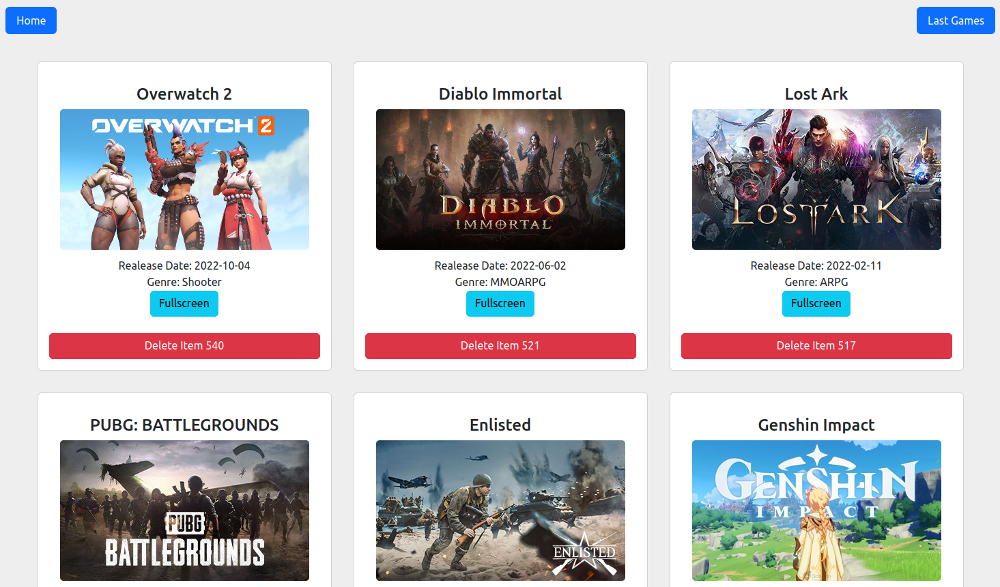

# Game API

Initialement réalisé dans le cadre d'un checkpoint de la Wild Code School. 

A partir d'une API (), on récupère une liste de jeux et on affiche les images associées avec la possibilité de supprimer des jeux de l'affichage, d'afficher les jeux les plus récents ou d'afficher l'image en plain écran.

Utilisation de React, Vite, Bootstrap et Axios.

Un aperçu ici: https://game-api.netlify.com/
